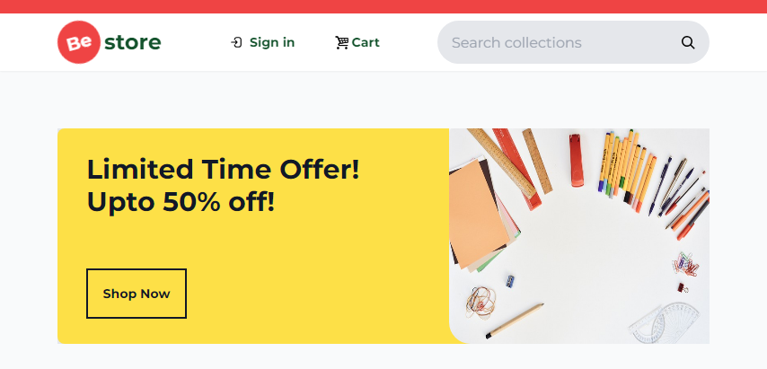

# best store
# A Multi-Product E-Commerce Website



Welcome to the best store (multi-product e-commerce website) project! This documentation will guide you through the setup, features, and usage of the e-commerce platform.

## Table of Contents

1. [Introduction](#introduction)
2. [Getting Started](#getting-started)
   - [Prerequisites](#prerequisites)
   - [Installation](#installation)
3. [Features](#features)
   - [User Features](#user-features)
   - [Admin Features](#admin-features)
   - [Merchant Features](#merchant-features)
4. [Technology Stack](#technology-stack)
5. [Deployment](#deployment)
6. [Contributing](#contributing)
7. [License](#license)

## Introduction

The best store E-Commerce website project is designed to provide users with a user-friendly platform for online shopping. It allows users to browse products, add them to the cart, and proceed to checkout. Admins can manage products, orders, and users, while merchants can list and manage their products for sale.

## Getting Started

### Prerequisites

- Node.js and npm installed.
- MongoDB database set up.


## Installation

1. Clone this repository to your local machine.
   ```bash
   git clone https://github.com/xyzeebit/best-store.git
   ```
2. Navigate to the project directory.
   ```bash
   cd best-store
   ```
3. Install the dependencies using npm or yarn.
   ```bash
   npm install
   ```
   or
   ```bash
   yarn install
   ```

## Usage

1. Obtain API keys from SUPABASE and replace `'VITE_SUPABASE_URL'` and `'VITE_SUPABASE_KEY'` in the `.env` file with your actual API keys.

2. Start the development server.
   ```bash
   npm run dev
   ```
   or
   ```bash
   yarn dev
   ```
3. Open your browser and navigate to `http://127.0.0.1:5173/` to view the app.

## Testing

Run the unit tests with the following command:
```bash
npm run test
```
or
```bash
yarn test
```

## Features

### User Features

- User registration and authentication.
- Browsing products by categories.
- Product search and filtering.
- Adding products to the cart.
- Viewing and editing the cart.
- Secure checkout process.
- Viewing order history.

### Admin Features

- Admin authentication.
- Managing products: Add, edit, delete products.
- Managing categories: Add, edit, delete categories.
- Managing orders: View, update order status.
- Managing users: View, deactivate accounts.

### Merchant Features

- Merchant registration and authentication.
- Dashboard for adding/editing products.
- Managing product details, images, and inventory.
- Setting product pricing and discounts.
- Managing shipping and tax information.

## Technology Stack

- Front-End: HTML, CSS, TailwindCSS, JavaScript (React)
- Back-End: Node.js (Express.js)
- Database: MongoDB
- Payment Gateway: Stripe
- Hosting: Vercel

## Deployment

1. Set up hosting environment (AWS, Heroku, etc.).
2. Configure domain, SSL certificate, and security settings.
3. Set up environment variables for the production environment.
4. Deploy the application using your chosen hosting platform's documentation.

## Contributing

I welcome contributions from the community! To contribute:

1. Fork the repository.
2. Create a new branch.
3. Make your changes and commit them.
4. Create a pull request with a detailed description of your changes.

## License

This project is licensed under the [MIT License](LICENSE).

---

Thank you for checking out my app! If you have any questions or feedback, feel free to reach out to me. Happy shopping!